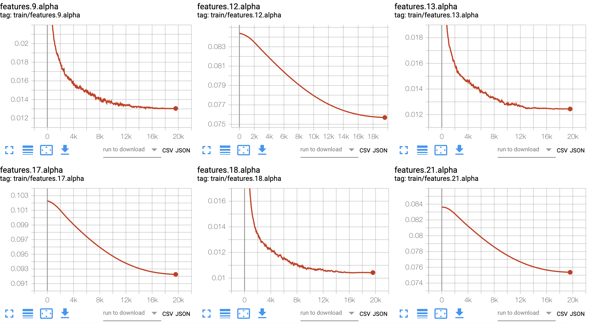

# LSQuantization
The PyTorch implementation of Learned Step size Quantization (LSQ) in ICLR2020 (unofficial)

---
The related project with **training code**: https://github.com/hustzxd/EfficientPyTorch (sorry for late.)

**The project is working in progress, and experimental results on ImageNet are not as good as shown in the paper.**

# ImageNet
| **LSQ**  | fp32         | w4a4 | w3a3 | w2a2 | w8a8(1epoch, quantize data) |
|----------|--------------|------|------|------|--------------|
| AlexNet  | 56.55, 79.09 | **56.96**, 79.46 [√](https://tensorboard.dev/experiment/MNSkwpg9SJySk201OqJLhw/) | 55.31, 78.59 |  51.18, 75.38 | |
| ResNet18 | 69.76, 89.08 | **70.26**, 89.34 [√](https://tensorboard.dev/experiment/bRQtjRFDRHGbJyQ6Jd3ztQ/) | 69.45, 88.85  |      | 69.68  88.92 [√](https://tensorboard.dev/experiment/jqrFL5q1QwSZRz3wSW6LQw/) |

## Hyper-parameter
| Hyper-parameter | LR   | LR-scheduler      | epochs | batch-size | wd   |
|-----------------|------|-------------------|--------|------------|------|
| AlexNet-w4a4    | 0.01 | CosineAnnealingLR | 90     | 2048       | 1e-4 |
| ResNet18-w4a4   | 0.01 | CosineAnnealingLR | 90     | 512        | 1e-4 |

## Experimental Results
====VGGsmall + Cifar10=======

|      | VGGsmall |
|------|----------|
| fp32 | 93.34    |
| w4a4 | **94.26**    |
| w3a3 | 93.89    |
| w2a2 | 93.42    |

